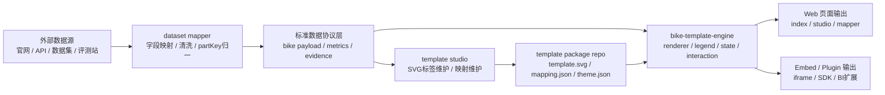
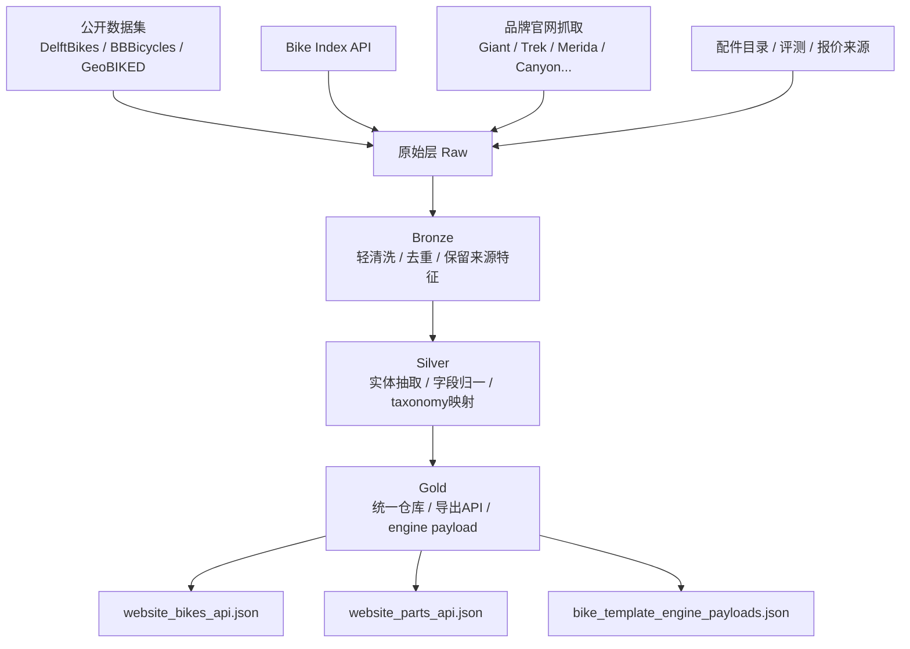
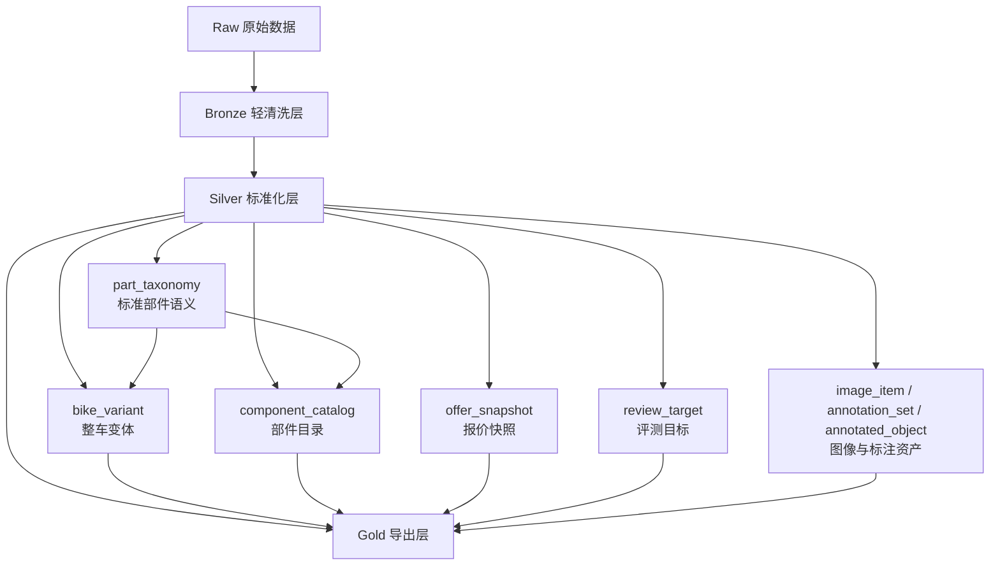
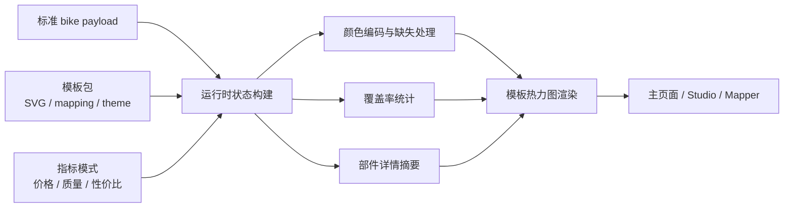
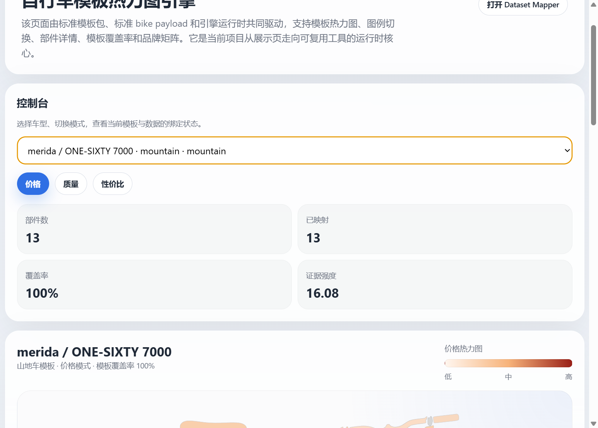
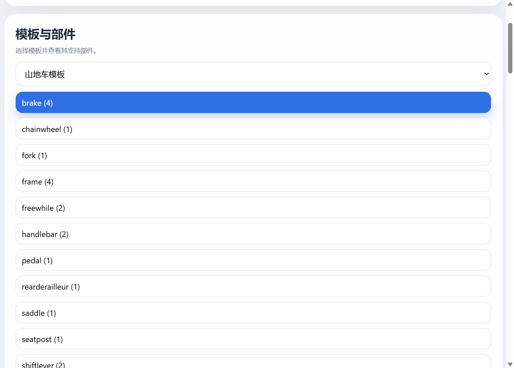
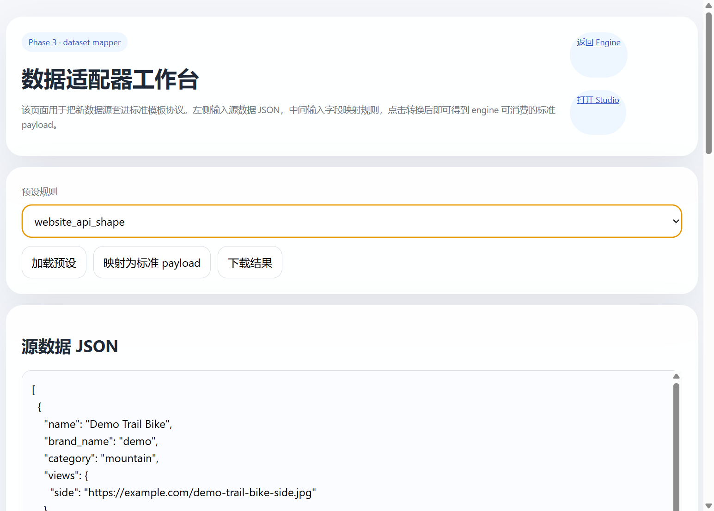

# 基于可复用 SVG 模板、多源数据仓库与统一运行时的自行车配件热力图可视化系统设计与实现

## 摘要

本实验面向《数据可视化》课程的综合实践要求，围绕“如何把复杂的自行车整车与配件信息转化为具有结构解释力的可视化表达”这一核心问题，设计并实现了一套集数据获取、数据治理、统一建库、模板设计、交互展示与工具化封装于一体的完整系统。项目并没有停留在传统课程作业中常见的静态图表或单一展示页层面，而是从真实工程问题出发，逐步构建了公开数据集接入、品牌官网抓取、公开 API 补充、评测与报价信息汇聚、数据库分层建模、标准部件 taxonomy 归一、SVG 模板热力图渲染以及前端统一运行时等一整条链路。通过这一过程，项目尝试回答两个彼此关联的问题：其一，如何面对来源分散、字段异构、噪声较高且部分缺失严重的自行车产品数据，建立一个可持续扩展的数据资产基础；其二，如何将这些数据转化为比传统参数表更直观、更具有结构语义、更适合教学展示与后续复用的可视化系统。

在数据层面，项目综合利用 DelftBikes、BBBicycles、GeoBIKED 等公开数据集，配合 Bike Index API、品牌官网以及公开配件目录与评测站点，构建了 `raw -> bronze -> silver -> gold` 的分层数据流，并围绕整车、配件、报价、评测、图像和标注建立统一实体设计。在视觉表达层面，项目通过 Inkscape 手工设计并维护了公路车与山地车两套可复用 SVG 模板，将车架、前叉、轮胎、刹车、传动、坐垫、座管、后避震等结构映射为稳定的语义区域，再结合价格、质量和性价比三类指标，实现了可切换图例的模板热力图展示。在工程组织层面，项目进一步将原有 `template_heatmap_showcase` 单页重构为 `bike-template-engine` 统一运行时，并实现 `template studio` 与 `dataset mapper` 两个配套工作台，使模板维护与数据接入由“改脚本”转变为“维护标准协议和模板包”。

实验结果表明，该系统已经能够较稳定地完成不同车型的模板切换、不同指标模式切换、部件点击联动、品牌部件矩阵联动，以及多源数据在统一模板上的可解释映射。更重要的是，本项目沉淀出的成果不只是若干可运行网页，而是一套具有继续扩展潜力的领域可视化工具原型，为后续接入计算机视觉部件识别、图像配准、实例分割、BI 组件化嵌入等方向奠定了基础。本文将围绕研究背景、需求分析、数据获取、建库设计、清洗治理、模板建模、引擎实现、页面实验、结果分析与课程关联等方面，系统阐述本实验的完整过程与主要结论。

**关键词：** 数据可视化；自行车数据仓库；SVG 模板；热力图；数据治理；模板引擎；课程实验

---

## 1. 研究背景与问题提出

### 1.1 研究背景

近年来，骑行文化在通勤、运动、社交与户外消费等多个场景中持续升温，自行车及其配件市场也呈现出明显的专业化和分层化趋势。从普通城市通勤车到竞速型公路车、越野型山地车，再到折叠车、电助力车，不同品类在结构构成、部件侧重点、品牌生态与价格体系上都表现出非常鲜明的差异。与此同时，用户在面对一辆自行车时往往不仅关心整车总价，更关心“贵在哪里”“哪些部件更值得升级”“品牌之间在同一结构位置上的配置差别是什么”“宣传中的技术术语究竟对应哪些真实部件”。这些问题本质上都要求数据具备结构化表达能力，也要求可视化不仅展示数字本身，更展示数字依附的对象结构。

然而，现实世界中的自行车数据并不天然适合直接可视化。品牌官网上的规格字段命名方式缺乏统一标准，不同站点对同一部件可能使用完全不同的术语；公开 API 更偏向记录整车实例，未必包含足够细的部件语义；电商或评测站点往往只提供局部价格、评分或文本描述，难以直接对应到标准部件槽位。若直接使用普通表格、列表或柱状图展示这些数据，用户仍然需要在脑中完成“字段名称 -> 部件位置 -> 价值理解”的多次转换，认知负担较重，不利于课堂展示与研究陈述。

正因为如此，本项目不将“做一个网页”视为最终目标，而是把问题进一步抽象为：能否建立一个面向自行车结构对象的、可复用的、可解释的模板可视化系统？这一问题同时连接了数据获取、数据清洗、数据库设计、可视编码、交互设计与工程工具化等多个层面的知识点，也使项目具有超出单一图表练习的综合实践价值。

### 1.2 问题定义

围绕最终目标，项目在实践中逐渐凝练出以下几个核心问题。首先，数据层需要解决多源异构问题，即如何把公开数据集、开放接口、品牌官网与评测报价站点中来源不同、字段不同、粒度不同的数据转化为可汇聚、可比较、可回溯的统一资产。其次，语义层需要解决部件归一问题，即如何把 `Groupset`、`Drivetrain`、`Frame Technology`、`Dropper Post`、`Wheelset` 等各种网站字段映射为模板可以理解的标准部件槽位。再次，视觉层需要解决模板表达问题，即如何在公路车与山地车结构差异较大的前提下，设计稳定且可维护的 SVG 结构模板，并支撑价格、质量、性价比等多维指标切换。最后，工程层还需要解决复用问题，即如何避免系统沦为一次性页面，而是沉淀为可持续扩展的 `bike-template-engine` 工具链。

### 1.3 研究意义

本实验的意义主要体现在三个层面。第一，在数据可视化表达层面，它尝试把数值型与文本型部件信息映射到一个带有真实结构语义的视觉空间中，超越了常见柱状图、饼图和表格列表的展示方式。第二，在数据工程层面，它展示了可视化系统与数据治理之间的紧密关系，说明漂亮的前端效果离不开严格的数据分层、映射规则和清洗流程。第三，在课程实践层面，它以完整工程链路的形式串联了数据采集、数据库设计、前端交互、可视编码与工具化重构，是一个兼具课程展示与研究延展性的项目。

---

## 2. 研究目标、需求分析与总体技术路线

### 2.1 总体目标

本项目的总体目标，是构建一套“基于可复用 SVG 模板、由多源数据仓库驱动、支持多维指标切换和后续扩展复用”的自行车配件热力图可视化系统。与传统做法相比，本系统的关注点并不是把整车信息简单列出来，而是把整车拆解为具有空间结构的部件语义对象，再通过颜色、图例、详情卡和辅助说明层，将价格、质量、性价比、证据强度等信息可视化地表达出来。

围绕这一目标，项目进一步提出了若干可执行的子目标：第一，构建能够持续扩容的数据获取链路，使系统不依赖单一来源；第二，设计适合整车、部件、报价、评测、图像与标注共同存在的数据库结构；第三，建立标准部件 taxonomy 与统一协议，使异构字段能够映射到模板；第四，使用 Inkscape 人工设计可长期维护的公路车和山地车 SVG 模板；第五，实现价格、质量、性价比三种核心模式切换；第六，在数据稀疏和噪声较大的场景下尽量提高着色成功率与系统稳定性；第七，将最终成果封装为可复用工具，而不是停留在一次性展示页。

### 2.2 需求分析

从使用场景看，本系统至少需要同时满足三类需求。其一是课程展示需求，即在答辩或论文中，系统要能够直观展示“整车由哪些部件构成、不同部件的指标如何变化、不同车型和品牌之间有什么结构差异”。其二是工程验证需求，即系统要具备真实的数据输入与转换过程，不能只依赖人工编造示例数据。其三是复用需求，即模板和渲染能力应尽可能沉淀为标准化资产，方便后续接入新的车型、新的品牌或新的外部数据源。

进一步分析可以发现，真正困难的并不是“做一个带颜色的 SVG 页面”，而是如何在系统内部保证数据与模板的对应关系长期稳定。只有当标准部件槽位、模板元素 ID、渲染状态、图例模式和页面交互都被抽象为规范后，整个系统才具备真正的扩展能力。因此，本实验在实现过程中始终把“规范设计”与“页面效果”放在同等重要的位置。

### 2.3 总体技术路线

为了让数据、模板与页面形成闭环，项目采用了“数据层 + 模板层 + 协议层 + 引擎层 + 交付层”的五层路线。数据层负责采集、清洗、建库与导出，模板层负责可复用 SVG 结构表达，协议层负责将数据与模板解耦，引擎层负责构建渲染状态和交互逻辑，交付层则面向网页、报告、工作台与兼容页面进行输出。该路线既体现出系统工程思维，也便于在不同阶段插入新的能力模块。

图 2-1 使用 Mermaid 描述了系统总体架构。可以看到，项目并非由一个前端页面孤立构成，而是由外部数据源、数据映射工作台、标准协议层、模板维护工作台、模板包仓库、统一运行时以及网页/嵌入输出共同组成。正是这种分层结构，支撑了系统从最初的展示页逐步演化为 `bike-template-engine` 可复用工具链。

---

## 3. 数据获取方案与多源数据采集过程

### 3.1 为什么必须采用多源数据获取

在本项目最初设想阶段，我曾尝试直接依赖少量品牌官网字段来完成展示，但很快发现这种方式难以支撑真正有解释力的部件热力图。原因在于，自行车整车页面虽然通常会给出“规格表”，但规格表往往只覆盖部分关键配置，且不同品牌之间字段命名和组织方式差异极大。仅依赖官网会造成三个后果：一是品牌覆盖面有限，二是价格与质量指标来源不足，三是很难形成面向后续视觉识别和标注流程的图像资产。因此，项目最终采取了多源采集路线，把公开数据集、公开 API、品牌官网、公开配件目录页和评测站点纳入统一采集体系，使不同来源承担不同角色。

从功能上看，公开数据集更适合承担图像、标注与视觉研究资产的角色；Bike Index API 更适合补充大量整车实例与文本记录；品牌官网提供最接近真实产品配置的官方规格；配件目录和公开评测站点则提供价格、评分、评论、热度等补充信号。这种分工并非冗余，而是为了弥补单一来源的结构缺陷。例如，官网页面通常比公开 API 更可信，但官网不一定提供跨平台价格比较；而评测站点评分可能较丰富，却缺乏稳定的整车结构字段。因此，只有将多源数据汇集到统一仓库中，再通过后续规则进行清洗和映射，才能真正支撑模板热力图所需的部件级可视化。

### 3.2 公开数据集接入

项目在视觉理解链路上提前考虑了未来扩展，因此从一开始就接入了 DelftBikes、BBBicycles、GeoBIKED 等公开资源。之所以选择这些数据集，并不是为了在本次课程实验中立即训练完整模型，而是因为它们分别对应了不同的研究价值：DelftBikes 对部件位置的结构化标注有助于理解标准部件集合；BBBicycles 对损坏识别和复杂场景分析有启发意义；GeoBIKED 则提供了可进一步解析的注释结构，便于后续抽取更细粒度的对象信息。项目并未把这些数据集当作独立附件存放，而是通过脚本把下载信息、manifest、注释文件和图像目录纳入工程资产目录，并规划接入统一数据库中的 `image_item`、`annotation_set` 与 `annotated_object` 实体。

这一做法有两个重要意义。第一，它让本系统不仅面向“静态网页展示”，同时也为之后“用户上传图片 -> 部件识别 -> 模板映射”的研究路线预留了正式入口。第二，它体现出课程项目中的一个关键工程意识：数据集不是只在训练脚本里使用一次的临时文件，而应被视为长期可复用的数据资产。正是基于这一思路，项目在后续论文撰写中也能够较自然地把网页可视化与计算机视觉扩展方向连接起来，而不是把它们当作完全割裂的两条路线。

### 3.3 公开 API 与增量扩抓

在整车覆盖面方面，Bike Index API 提供了宝贵的开放入口。为了避免样本过于单一，项目围绕公路、山地、通勤、越野、电助力等多种关键词设计了增量扩抓脚本，通过多轮查询逐步补充整车实例记录。与一次性全量抓取相比，这种增量抓取方式更适合课程工程迭代：一方面便于在不同阶段逐步扩大覆盖面，另一方面也更容易观察新增数据对数据库质量与可视化效果的影响。

不过，API 数据虽然规模较大，却存在字段粒度不稳定、部件信息不完整的问题。为此，项目在导入过程中并未直接将其视为最终前端数据，而是把它作为整车候选记录和品牌/车型补充来源，配合后续官网规格与配件证据一起参与统一导出。换言之，Bike Index 在本项目中承担的是“丰富样本空间”的角色，而不是“直接决定热力图颜色”的唯一来源。

### 3.4 品牌官网抓取与浏览器自动化

品牌官网数据是整个工程中最关键、也最耗时的部分。Giant、Merida、Trek、Canyon、Cannondale、Specialized 等整车品牌通常能提供较完整的配置表，而 Shimano、SRAM 等品牌则更多呈现配件或套件页面。不同站点在页面技术实现上差异很大，有的使用传统 HTML 结构，有的依赖前端渲染，有的产品规格隐藏在可折叠面板或动态接口中。因此，项目为采集链路设计了普通抓取器与浏览器自动化抓取器两种机制，并结合品牌级规则进行过滤和下钻。

实践中，这部分工作的难点不在于“能否抓到网页”，而在于“抓到的内容是否真的是整车配置”。例如，一些 Trek、Cannondale、Canyon 页面虽然看似产品页，但其中可能混入故事页、系列页或营销活动页；而 Shimano、SRAM 页面则容易以组件说明页、套件页、产品系列页的形式被误识别为整车。项目为此逐步加入了按品牌划分的 URL 过滤、标题 token 过滤、页面结构过滤与非整车关键词过滤规则，使官网数据的有效性逐步提升。这个过程说明，真实的数据工程远不是“爬下来就能用”，而是需要不断围绕目标任务反复修正采集口径。

### 3.5 配件目录、报价与评测信息补充

仅靠整车规格仍然不足以支撑价格与质量这两个维度的可视化，因此项目还进一步接入了公开配件目录页、报价来源和评测来源，用于构建 `offers`、`reviews` 与 `heatmap_metrics` 信号。由于不同来源对同一部件的命名方式不同，项目需要结合品牌词、短型号词、类别词和标题正文上下文进行对齐，把这些文本线索尽可能映射到标准部件 taxonomy 上。这一过程并非追求百分之百精确，而是力求在保证解释性的前提下，为每个部件建立尽可能丰富的证据来源。

图 3-1 使用 Mermaid 展示了本项目的数据获取主流程。可以看到，原始网页、API 与公开数据集并不是直接流向前端，而是先经过采集、标准化、实体抽取与仓库分层，再逐步导出为网站 API 与引擎标准 payload。正是这一流程，保证了系统在不断扩容数据源时仍能维持可控的数据质量。

---

## 4. 数据库设计与统一数据仓库建设

### 4.1 数据仓库分层思想

在数据可视化课程中，很多作业往往默认数据是“已经整理好的”。但本项目在实践中深刻体会到，真正影响可视化质量的往往不是某个配色方案，而是数据在进入前端之前是否经过了足够严格的分层治理。为此，项目采用了 `raw -> bronze -> silver -> gold` 的四层设计。`raw` 层保存原始下载结果、抓取页面、接口返回和外部文件；`bronze` 层进行轻清洗、结构抽取与去重，保留来源特征；`silver` 层则完成更进一步的实体化、字段对齐与关系建立；`gold` 层面向分析与前端导出，生成高质量 API、模板 payload 和页面运行时所需资源。

这一分层思想的好处体现在三个方面。第一，任何前端异常都可以向上回溯到导出规则甚至原始来源，便于定位问题。第二，当清洗逻辑调整时，可以从中间层重新构建，而不必反复回到最原始网页。第三，不同下游任务可以共享上游结果，例如网页 API、模板引擎 payload 和未来的训练样本索引都可以基于同一套 `silver/gold` 层结果生成，从而减少重复劳动。

### 4.2 统一实体设计

项目没有把所有字段简单堆进一张大表，而是围绕“整车、部件、报价、评测、图像、标注”这些不同层级的对象建立统一实体体系。整车层的核心是 `bike_variant`，用来表示具体车型或产品变体；部件层的核心是 `component_catalog`，用于沉淀标准化部件目录和部件证据；交易与外部评价层主要通过 `offer_snapshot` 与 `review_target` 承担，用于记录价格、平台、时间与评分等信息；视觉资产层则由 `image_item`、`annotation_set`、`annotated_object` 等实体组成，以便与未来的识别和配准流程相衔接。此外，`part_taxonomy` 作为上游语义标准，为官网规格映射、模板包设计和引擎渲染提供统一部件基准。

这种设计有意识地把“整车是什么”“部件是什么”“图像是什么”“证据是什么”区分开来。这样做的目的并不是为了追求数据库形式上的复杂，而是为了确保系统在不断扩展数据源时仍然能够维持语义清晰。例如，一个后拨既可以作为整车配置的一部分出现，也可以在配件目录里作为独立商品出现，还可以在图像标注中作为检测对象出现。如果没有统一 taxonomy 和实体关系，后续所有展示都会变得混乱。

### 4.3 从官网规格字段到标准部件槽位

官网规格的核心难题在于：网站字段不是为模板热力图设计的。品牌官网常见的 `Frame Technology`、`Suspension System`、`Groupset`、`Wheelset`、`Cockpit` 等字段，有的描述单一部件，有的描述部件组合，有的甚至只是营销性命名。若直接把这些字段原样导出到前端，就会导致同一结构位置被重复占据、模板难以稳定着色，或者页面上出现一长串无法解释的宣传文本。为了解决这一问题，项目定义了统一的标准部件槽位，例如 `frame`、`fork`、`shock`、`seatpost`、`saddle`、`handlebar`、`brake`、`tyre`、`derailleur`、`cassette`、`crankset`、`shifter`、`pedal` 等，并通过规则逐步将原始字段归一到这些槽位。

这一过程本质上是一种“面向模板的语义降维”。它要求系统从复杂、冗长且经常带有品牌宣传语言的规格文本中，提取出真正决定结构可视化的对象信息。也正因为这一层归一逻辑的存在，后续模板包、引擎协议和前端页面才能围绕统一的 `partKey` 集合稳定运行。

### 4.4 面向前端与引擎的导出

在统一仓库建设完成后，项目并没有直接让前端读取数据库表，而是专门设计了两类导出结果。第一类是 `website_bikes_api.json`、`website_parts_api.json`、`website_components_api.json` 这类面向网页层展示的 JSON 输出，用于提供较完整的页面数据；第二类是 `bike_template_engine_payloads.json` 这类面向统一运行时的标准 payload，用于让 `bike-template-engine` 在不依赖数据库结构细节的前提下直接构建渲染状态。两类导出的并存，使系统既保留了工程透明度，又获得了工具化复用能力。

图 4-1 使用 Mermaid 展示了统一数据库的分层思路与实体关系。图中从原始采集到实体标准化再到最终导出的路径，清晰反映了本项目“数据库设计服务于可视化，而可视化反过来检验数据库设计”的总体逻辑。也正是在这一循环中，数据库不再只是被动存储信息的容器，而成为支撑可视化系统稳定运行的核心基础设施。

---

## 5. 数据清洗、归一化与质量控制

### 5.1 数据问题的具体表现

随着数据规模逐渐扩大，项目很快发现前端页面中的许多“显示异常”其实源自数据层问题，而不是页面样式问题。例如，某些山地车页面大面积发灰，并不是因为模板颜色函数失效，而是因为真实可用于映射的部件记录太少；有些车型的 `frame` 位置显示出冗长而奇怪的内容，是因为营销型字段被误当成真实部件；有些本应属于座管的记录被映射到了后避震，是因为文本中同时出现了 `travel`、`dropper` 等词信号。由此可见，数据清洗并不是“前端完成后补一补”的收尾工作，而是决定系统能否稳定运行的关键步骤。

### 5.2 营销噪声过滤

品牌官网为了营销传播，往往会在规格区域或相邻模块中加入大量技术宣传文本。例如 `Frame Technology` 可能并不是一个单独部件，而是关于车架制造工艺、走线方式、几何设计甚至品牌专有术语的综合说明。如果这些内容被直接导入模板系统，就会造成两个严重后果：第一，用户看到 `frame` 区域似乎“信息很多”，但实际上都是无法比较的宣传文本；第二，真正缺失的部件会被噪声掩盖，影响热力图的诚实表达。针对这一问题，项目设计了基于字段名称、token 模式和文本长度特征的过滤逻辑，对过长、过营销化、不像真实组件名的记录进行降权或剔除，从而恢复部件层数据的可解释性。

### 5.3 部件键归一与误判修复

在山地车场景下，`seatpost`、`dropper post` 与 `shock` 的混淆是最典型的问题之一。很多车型规格中会出现 `travel seatpost`、`dropper post` 等描述，如果仅根据局部词汇判断，系统很容易因为出现 `travel` 而误把它归为避震。为解决这一问题，项目在规则中强化了对 `seatpost`、`dropper` 等词信号的优先级判定，确保这些记录优先落入座管槽位。此外，项目还逐步修复了 `wheel -> tyre`、`groupset -> derailleur/drivetrain`、`cassette / freewheel / freewhile` 等多个语义映射边界问题，使模板映射结果更符合视觉语义而非字面字段语义。

### 5.4 非整车页面过滤

在实际抓取中，一个非常容易被忽视的问题是：一些组件品牌页面会被系统误判为整车页面。尤其在 Shimano、SRAM 等站点中，`Transmission`、`Brakes`、`Groupset` 等产品页如果混入整车候选集合，就会导致页面上出现看似“部件很齐全”的假整车。为避免这一问题，项目按品牌类型、URL 结构、标题关键词和页面上下文联合设计了非整车过滤规则。经过修复后，整车候选集合的纯度显著提升，模板热力图也更能反映真实车型配置。

### 5.5 稀疏数据条件下的保守回填

尽管经过多轮清洗，山地车数据仍然存在天然稀疏的问题。一些官网页面只给出少量核心规格，若完全遵守“无数据即不显示”的原则，最终模板将大面积灰化，不利于系统演示与用户理解。为此，项目在明确标注前提下设计了保守的代表件回填策略：仅在真实可视化槽位严重不足时启用，只对关键槽位回填代表件，同时在数据结构中保留 `inferred` 或 `representative` 标记，避免把推断结果伪装成官方实配。这一策略体现了可视化中的一个重要原则，即在可读性与数据诚实之间寻找平衡，而不是简单追求“画面填满”。

通过上述清洗与治理，项目逐渐把许多看似前端问题的异常现象追溯并修复到数据层，从而显著提高了系统的整体稳定性。这一阶段的工作也证明：在领域可视化系统中，数据治理往往比页面调样式更加决定成败。

---
## 6. 可复用 SVG 模板设计与 Inkscape 手工建模

### 6.1 为什么选择 SVG 模板作为核心视觉载体

在项目早期讨论中，曾经存在两条可能路线：一条是直接对真实自行车图片进行分割和上色，另一条是先建立标准侧视图模板，再将数据映射到模板区域。经过多轮实验与比较后，项目最终明确选择后者作为主方案。这并不是因为真实图片方案没有吸引力，而是因为课程实验和系统原型需要首先保证稳定性、可解释性和可维护性。真实照片会受到拍摄角度、光照、背景、遮挡、车辆姿态和图像清晰度等多种因素影响，即使后续接入实例分割模型，也需要进一步解决姿态配准、模板对齐和局部遮挡处理问题。相比之下，SVG 模板提供了稳定的结构空间，可以让同一部件在不同页面、不同指标模式和不同品牌比较中都落在一致位置。

更重要的是，SVG 模板具有明显的工程优势。首先，模板中每个元素都可以绑定明确的 `id` 或标签，适合承载点击、悬停、联动、说明层和导出逻辑。其次，模板既可以在网页中直接交互，也可以方便地导出 PNG，适合课程报告与答辩展示。再次，模板作为一种独立资产，可以脱离具体页面长期维护，从而为后续形成模板包规范、模板工作台和前端 SDK 奠定基础。因此，本项目虽然没有放弃未来结合视觉识别的设想，但在当前阶段将 SVG 模板确立为主视觉方案，是一种兼顾可实现性与可扩展性的技术选择。

### 6.2 Inkscape 手工设计过程

本项目的模板并不是通过简单下载现成图标得到的，而是由用户在 Inkscape 中围绕标准侧视图进行人工拆分、修正和标注，逐步形成了公路车和山地车两套可复用模板。这个过程虽然带有明显的手工性质，但也正因如此，模板具备了较强的语义可控性。具体而言，模板设计阶段主要完成了以下工作：对标准自行车轮廓进行梳理；把车架、前叉、轮胎、把组、刹车、飞轮、链轮、后拨、坐垫、座管和避震等结构拆分成独立区域；为不同图层或路径设置稳定的 `id` 和 `inkscape:label`；针对山地车额外补充 `Shock_Absorber`、`rear_shock_absorber`、`front_brake` 等更具针对性的标签；最后再通过网页运行时不断回看实际着色效果，反复修正模板映射。

值得强调的是，这种手工模板设计不是低效的“体力活”，而是项目成功的重要前提。因为只有当模板区域与标准部件语义足够稳定时，后续的数据映射和前端交互才有可靠基础。也正因此，论文中特别需要指出：模板不是系统中的附属文件，而是与数据库 schema、标准协议同等重要的核心资产。

### 6.3 公路车与山地车模板差异

公路车与山地车虽然都属于自行车，但两者在结构表达上存在显著差异。公路车更强调流线型车架、刚性前叉、轻量化轮组与竞速姿态，而山地车则常见粗壮车架、避震前叉、后避震系统、越野轮胎与更复杂的制动/传动布局。如果强行使用同一模板，不仅会造成视觉失真，也会使部件映射变得混乱。因此，项目分别维护两套模板，并在数据层根据车型判断结果自动切换模板类型，使同一标准协议能够在不同视觉骨架上完成渲染。

图 6-1 展示了公路车模板的预览形态。该模板更适合承载轻量化、竞速导向的配置表达，结构上强调车架三角、轮组和把组等核心区域。

图 6-2 展示了山地车模板的预览形态。与公路车相比，山地车模板在前叉、后避震、刹车和轮胎等区域的表达更加突出，也更适合展现越野车型在避震与驱动系统上的结构特点。

### 6.4 模板映射的语义设计

模板映射并不是“一个部件对应一个 SVG 元素”的简单字典关系。现实中，一个部件语义往往会映射到多个路径对象，例如 `frame` 可能对应上管、下管、后上叉、后下叉等多个区域；`brake` 可能同时涉及前后刹车器和部分刹把；`shock` 在山地车中又可能包含前叉避震与后避震两个不同位置。因此，本项目在模板包中采用 `partKey -> svg id[]` 的一对多映射设计，使视觉区域能够更真实地承载语义对象。这种设计不仅提升了着色表现力，也让模板工作台在维护过程中具备了更高的灵活性。

### 6.5 模板设计在课程项目中的作用

从课程实验角度看，模板设计的意义不仅在于“页面更好看”，更在于它提供了一种结构化对象可视化的方法论。传统统计图常常把数据映射到笛卡尔坐标系中，而本项目则把“自行车结构”本身作为视觉空间，让部件槽位成为可视编码落点。这种做法能够更直接地激发用户的空间理解，也更适合作为答辩时解释系统逻辑的核心视觉入口。

---

## 7. bike-template-engine 的架构设计与统一运行时实现

### 7.1 从单页 Showcase 到统一 Engine

项目早期确实是从 `template_heatmap_showcase` 单页开始的。当时为了快速验证“模板热力图是否可行”，大量逻辑直接写在一个页面生成脚本中，包括模板读取、数据拼接、颜色计算、图例切换、详情卡联动和页面 HTML 生成。这种方式在原型阶段非常高效，但随着公路车与山地车模板并存、品牌和部件数据不断增加、页面中开始加入品牌矩阵、工作台和兼容导出后，单脚本方案迅速暴露出难以维护的问题。于是，项目后期决定把展示逻辑进一步抽象为统一运行时，并正式命名为 `bike-template-engine`。

这一重构的核心思想是：页面不再直接依赖某个特定导出脚本，而是由标准协议、模板包和运行时引擎共同驱动。这样一来，旧页面不必彻底废弃，而可以作为兼容入口继续存在；新的页面和工作台则统一围绕引擎能力构建。该设计一方面保留了既有成果，另一方面也明显降低了后续维护成本。

### 7.2 标准协议层设计

为了让引擎不依赖数据库内部表结构，项目专门设计了标准协议层。协议中包含整车基本信息、车型类型、模板类型、部件列表、指标字段、证据强度和用于渲染的辅助状态等内容。对每个部件而言，系统不仅记录其 `partKey`、`displayName` 和 `templateLabels`，还进一步维护价格、质量、性价比、证据覆盖度和颜色计算所需的渲染信息。通过这一协议层，数据源与页面之间形成了清晰边界：只要新数据源能够映射为标准 payload，引擎就可以直接完成渲染，而无需在前端新增专用逻辑。

### 7.3 模板包规范

与协议层对应，项目还将公路车和山地车模板沉淀为正式模板包。一个模板包不仅包含 `template.svg`，还包含 `mapping.json`、`theme.json`、`schema.json`、`preview.svg` 和包级元信息文件。这样的结构使模板不再是“某个目录下的一张图”，而成为具备版本化、可说明、可验证、可导出的正式资产。尤其是 `mapping.json` 的存在，使模板映射从分散在代码中的字典迁移到可单独维护的文件中，为后续工作台化和插件化奠定基础。

### 7.4 引擎渲染流程

在实现层面，`bike-template-engine` 主要完成三类工作。第一类是构建渲染状态，即根据不同指标模式对部件值进行归一、颜色映射、缺失状态标记和覆盖率统计；第二类是构建聚合视图，例如品牌-部件矩阵、模板覆盖摘要和部件详情卡；第三类是面向页面交付，输出主页面、模板工作台和数据映射工作台所需的运行时数据。由于这些能力都围绕标准协议与模板包实现，因此旧 `template_heatmap_showcase` 目录最终也可以切换到底层同一套运行时逻辑之上。

图 7-1 使用 Mermaid 展示了统一运行时从标准 payload、模板包和指标模式出发构建最终渲染状态的过程。可以看到，模板热力图并不是静态图片，而是由协议解析、颜色编码、覆盖率统计、交互状态和摘要信息共同生成的运行时结果。

### 7.5 Template Studio 与 Dataset Mapper

仅有引擎还不足以支撑复用，因此项目又实现了两个配套工作台。`template studio` 主要解决模板维护问题。过去若要增加一个新的部件标签或修正 SVG 元素绑定，往往需要同时改 SVG 文件和代码中的映射字典，既费时又容易遗漏。通过 `template studio`，开发者可以直接查看模板、已绑定元素和未绑定元素，并围绕 `mapping.json` 进行更透明的维护。`dataset mapper` 则用于解决新数据源接入问题。当外部 JSON、第三方接口或实验性采集结果需要接入系统时，Mapper 可以将其字段映射为标准协议，使引擎仍然只面对统一 payload，而不是面对无穷多种输入格式。

从系统设计的角度看，这两个工作台的出现意味着项目已从“做出一个效果”进一步走向“让他人也能接着维护和扩展这个效果”。这正是课程实验升级为工具原型的重要标志。

---

## 8. 可视化页面实现、交互组织与图文展示

### 8.1 统一运行时主页面

在最终交付中，主页面承担的是系统核心展示功能。页面围绕标准模板热力图组织信息，用户可以选择具体车型，切换价格、质量和性价比三种模式，并通过点击部件查看更加详细的配件摘要、评分线索和证据说明。与初期原型相比，统一运行时主页面不仅在视觉上更稳定，也具备了更清晰的结构层次：左侧为模板主体和图例控制，中间为部件详情和品牌说明，右侧则可扩展为品牌-部件矩阵、说明卡或故事化叙事区域。

从图 8-1 可以看到，主页面已经不再只是一个“着色图形”，而是一个完整的信息面板。模板热力图负责提供空间语义和快速感知，图例切换负责将不同指标模式统一到同一套结构骨架之上，详情卡则帮助用户把颜色直觉进一步转化为具体文字理解。这样的组织方式符合课程中“总览 + 局部细节 + 交互解释”的经典可视化原则。

### 8.2 Template Studio 页面

`template studio` 页面是本项目较具工具特征的成果之一。它把过去隐藏在代码内部的模板映射关系公开化、界面化，使模板维护过程变得更透明。在这个页面中，用户可以查看模板预览、已绑定部件、未绑定元素以及建议映射，从而快速定位“为什么某个部件没有着色”“为什么某个部件映射到了错误区域”等问题。这一工作台对于后续继续扩充车型模板尤其重要，因为新增一套模板时，最先需要解决的往往不是前端美化，而是部件区域是否标注充分、映射是否完整。

图 8-2 展示了模板工作台的页面形态。它强化了模板即资产、映射即配置的设计思想，也让系统从“工程师私有知识”转向“可视化可维护知识”。从课程答辩角度看，这一页面也很适合说明项目如何从单页展示迈向工具化复用。

### 8.3 Dataset Mapper 页面

`dataset mapper` 页面则承担了数据接入与协议转换的功能。由于新数据源经常拥有完全不同的 JSON 结构，如果每接入一个来源都需要重写页面逻辑，那么系统很快会失去复用价值。通过 Mapper，开发者可以把外部字段映射为标准 `bike payload`，并校验部件键、模板标签和指标字段是否齐全，从而在不触碰前端渲染核心的情况下完成新来源接入。

图 8-3 所示页面体现出本项目的另一个重要特点：它不仅展示结果，也展示“结果是如何被组织出来的”。这对于课程实验尤其重要，因为一个优秀的可视化作业不应只有最终界面，还应能够说明数据如何进入系统、如何被转换、如何落到模板中。

### 8.4 多模式图例与信息组织方式

本系统在视觉编码上主要围绕价格、质量和性价比三种模式展开。价格模式强调经济成本差异，适合回答“贵在哪里”的问题；质量模式更多反映部件评价和可靠性线索，适合回答“哪些部件更值得信赖”的问题；性价比模式则试图在价格和质量之间建立平衡，帮助用户理解“高价是否带来对应收益”。三种模式共用同一结构模板，但颜色策略和图例文案可切换，从而形成“同一辆车，不同评价视角”的并置观察效果。

这种设计相比直接切换整张页面有明显优势：它既保留了用户对空间结构的连续认知，又通过图例与颜色差异引导用户从多个维度重新理解同一对象。在答辩展示中，这种模式切换也能非常直观地体现“数据编码设计”的课程知识点。

---
## 9. 实验实施过程的阶段性推进

### 9.1 第一阶段：从数据仓库雏形出发

项目最早并不是从模板引擎开始，而是先从多源数据仓库建设切入。原因在于，如果没有相对可靠的数据基础，任何前端设计都只能停留在演示级样板。第一阶段的重点因此放在公开数据集下载、官网采集方案调研、公开 API 扩抓和数据库 schema 草拟上。此时系统的主要目标是让整车、配件、报价与评测四类对象能够出现在同一工程内，并形成最基本的查询和导出能力。虽然这一阶段的页面效果尚不突出，但它为后续所有工作提供了扎实地基。

### 9.2 第二阶段：标准模板热力图原型形成

当数据仓库具备初步整合能力后，项目开始进入热力图可视化阶段。此时最关键的抉择是：放弃把真实照片直接作为主展示载体，转而围绕标准 SVG 模板构建页面。随后，系统逐步完成了公路车模板制作、部件槽位定义、价格热力图着色、详情卡联动与多车型切换等能力。这个阶段的成果第一次让“自行车部件级可视化”真正落地，也证明了模板热力图在课程展示中的可行性。

### 9.3 第三阶段：多车型扩展与山地车适配

随着公路车模板趋于稳定，项目很快遇到新问题：单一模板无法覆盖山地车结构。用户随后加入山地车 SVG 模板，这使系统必须从“一个模板、一个映射字典”升级为“多模板、多类型、多映射规则”的形态。山地车模板的接入不仅是视觉资源增加，更引发了一系列上游设计调整，例如车型判断逻辑、模板选择逻辑、部件键扩展、避震与刹车标签补充等。也正是在这一阶段，系统开始真正呈现出“模板引擎”而非“单页特效”的特征。

### 9.4 第四阶段：山地车大面积灰化问题排查

山地车接入后，系统一度出现大量着色失败现象，页面中许多车型几乎全部发灰。经过逐层排查，最终确认问题并不单一，而是模板层与数据层共同作用的结果：一方面，山地车模板中确实存在 `shock`、`front_brake` 等标签不足或映射不全的问题；另一方面，官网导出的 mountain 数据本身也存在部件过少、营销文本污染、组件页误入整车集合等严重问题。项目随后依次补齐模板标签、修正 `seatpost` 与 `shock` 的混淆、过滤 `Frame Technology` 一类营销字段、剔除 SRAM/Shimano 等组件页污染，并在极端稀疏场景下引入保守回填策略。经过这一轮修复，山地车页面终于从“几乎不可用”变为“可以稳定展示关键结构区域”。

### 9.5 第五阶段：从 Showcase 重构为 Engine

当页面功能逐渐增多后，系统开始面临典型的原型膨胀问题：页面脚本中混杂了模板解析、数据拼接、颜色计算、图例逻辑、品牌矩阵、详情卡与导出逻辑，继续叠加新功能会显著增加维护成本。因此，项目在后期正式启动了工具化重构工作，把原本的 `template_heatmap_showcase` 单页抽象为 `bike-template-engine` 统一运行时，并补充 `template studio` 与 `dataset mapper`。这一阶段使整个工程完成了从“课程页面”到“可复用工具原型”的跃迁，也是本次实验最具工程价值的成果之一。

### 9.6 第六阶段：文档化、截图化与论文表达完善

在系统功能基本稳定后，项目最后进入文档整理与论文撰写阶段。此时不再只关注代码运行是否成功，而是进一步围绕实验报告、README、设计文档、架构图、流程图和页面截图进行系统性整理。通过补充系统架构图、数据获取流程图、数据库分层图、引擎运行时流程图、公路车与山地车模板预览以及三大页面截图，项目最终形成了既能运行、又能阐释、还能扩展的完整成果表达。这一阶段的工作说明，一个成熟的课程实验不仅要“做出来”，还要“讲清楚”。

---

## 10. 实验结果与效果分析

### 10.1 数据层结果分析

从数据层面看，本项目已经形成较完整的多源数据工程链路。系统能够持续接入公开数据集、公开 API、品牌官网与外部评测来源，并通过统一仓库输出前端 API 和引擎标准 payload。这意味着前端页面不再依赖人工拼接少量样例数据，而是建立在真实且可持续更新的数据基础之上。更关键的是，数据层已经拥有向上支撑模板可视化、向侧支撑品牌分析、向下支撑视觉数据资产管理的能力，具备继续扩容的空间。

### 10.2 模板热力图结果分析

在可视化表达层面，系统已经能够对公路车和山地车两种结构模板进行稳定切换，并在价格、质量、性价比三种模式下生成对应热力图。这种结果意味着：同一辆车可以在不改变空间结构的前提下，从不同维度被重新解释，用户对结构的认知不会因为模式切换而中断。相比直接切换不同图表，模板热力图更适合表达“对象结构稳定、评价视角变化”的场景，也更符合自行车这种部件化产品的认知逻辑。

### 10.3 山地车修复结果分析

山地车部分是最能体现本项目工程深度的实验结果之一。初始阶段，mountain 页面经常因为真实部件记录不足、模板标签不完整和误导出的伪整车数据而无法正确着色。经过系统性的清洗和修复后，`shock` 成为可稳定识别的模板槽位，`seatpost` 与 `shock` 的混淆被大幅缓解，营销型 `frame` 文本被有效抑制，组件页污染被显著清除，稀疏样本也能够在保守策略下维持较高的可读性。这个结果说明，领域可视化系统的可用性并不只是前端设计问题，更是一整套数据工程问题。

### 10.4 工具化结果分析

如果仅从课程作业角度出发，做到一个可以切换颜色模式的 SVG 页面其实已经足够交差。但本项目继续向前推进，最终交付了标准协议、模板包规范、统一运行时、模板工作台和数据映射工作台等一整套工具链。这意味着项目成果已经不再局限于“这次实验能不能展示”，而是具备了“未来新模板如何接入、新数据源如何接入、旧页面如何兼容”的系统级回答。对于课程论文而言，这部分正是最能体现创新性和完整性的内容。

### 10.5 可视化表达方式的优势与不足

模板热力图最大的优势，在于它把抽象数值重新附着到用户熟悉的结构对象上，降低了理解门槛。用户可以不先阅读长列表，而是先通过颜色快速理解整车结构中的重点位置，再通过点击与详情卡深入查看具体部件信息。此外，多模式切换和品牌部件矩阵又进一步弥补了模板热力图“总览强、精确比较稍弱”的不足，使系统同时具备结构感知与分析补充能力。当然，该表达方式也存在局限：它依赖模板质量，难以直接覆盖极不规则的车型；对完全缺失的数据只能诚实留白或有限回填；若要进一步接入真实照片，还需引入更强的视觉理解链路。这些局限并没有削弱当前成果的价值，反而清楚界定了未来继续研究的边界。

---

## 11. 与《数据可视化》课程知识点的对应关系

### 11.1 数据获取与预处理

本项目与课程知识点的第一重对应，体现在数据获取与预处理上。项目并未默认拥有整洁数据，而是从数据源选择、爬虫设计、公开 API 扩抓、官网页面解析、结构化字段抽取、去重、清洗和归一化开始，完整复现了一个真实可视化工程的数据前处理链路。这部分工作使课程中的“数据预处理”不再停留在 CSV 清洗层面，而扩展到异构网页与多源仓库治理层面。

### 11.2 数据建模与视觉编码

第二重对应体现在数据建模与视觉编码。项目把复杂的规格文本和外部评价信号抽象为标准部件槽位，再把价格、质量、性价比等指标分别映射为颜色通道；把缺失或证据不足映射为低饱和与低透明表达；把部件详情和证据条目映射为点击联动内容。这一整套过程正对应课程中“数据 -> 视觉变量 -> 交互解释”的核心思路。

### 11.3 结构化对象可视化

第三重对应是结构化对象可视化。课程中最常见的是统计图表，而本项目进一步探索了将领域对象模板作为视觉空间的方式。这种做法说明，可视化不一定总是建立在 X-Y 坐标系之上，它也可以依附于产品结构、空间轮廓和语义区域来组织信息。自行车模板热力图正是对此类高级可视化方式的一次较完整实践。

### 11.4 交互设计与多视图组织

第四重对应是交互设计。系统支持部件点击、图例模式切换、车型切换、详情卡联动、工作台查看和数据映射过程展示，体现了可视化系统中从总览到细节、从结果到依据、从主页面到辅助工作台的多视图组织方式。这也说明交互不是单纯的前端装饰，而是帮助用户逐步理解复杂系统的重要桥梁。

### 11.5 可视化系统工程观

第五重对应，也是本实验最具课程提升意义的一点，在于它体现了可视化系统工程观。项目不仅完成了图形界面，还同时完成了数据库设计、模板规范、标准协议、构建脚本、兼容入口与论文文档等多个方面。由此可以看到，真实世界中的数据可视化往往并不是最后“画一张图”，而是一个从源头到交付的系统工程过程。

---

## 12. 局限性、反思与后续改进方向

### 12.1 当前系统的局限性

尽管本项目已经形成较为完整的原型，但它仍然存在若干清晰可见的局限。首先，官网抓取高度依赖页面结构，品牌页面一旦改版，采集规则就需要重新调整。其次，山地车和部分小众车型的数据仍然不够饱满，部分页面仍需要依赖保守回填策略维持可视化可读性。再次，当前的模板仍主要依赖手工 Inkscape 设计与维护，这保证了语义稳定，却也意味着新增车型模板需要投入较多人工成本。最后，系统虽然已经为未来的计算机视觉路线准备了图像与标注入口，但尚未真正完成“用户上传图片 -> 自动识别部件 -> 对齐标准模板 -> 生成个性化热力图”的全闭环。

### 12.2 反思：为什么要坚持工具化重构

在课程项目中，最容易忽略的一点是“当页面已经能跑时，是否还需要继续重构”。本项目的实践给出的答案是肯定的。因为如果没有后续的工具化抽象，很多成果会随着代码膨胀而失去可维护性，也很难在论文中被清晰阐释。正是由于后续构建了 `bike-template-engine`、`template studio` 和 `dataset mapper`，系统才真正获得了结构上的清晰性与表述上的完整性。这一点也是本实验中最值得总结的经验之一：适度重构并不是浪费时间，而是在为成果的复用、表达和延展创造条件。

### 12.3 后续改进方向

后续工作可以沿三个方向继续推进。第一，继续增强数据层，针对 Trek、Cannondale、Canyon、Merida 等品牌构建更稳定的整车页过滤和变体抽取规则，并进一步补充真实部件价格与评测证据。第二，增强模板层和工具层，引入模板版本管理、映射校验、自动发现未绑定元素和更多车型模板，从而让 `template studio` 真正具备生产级维护能力。第三，向视觉理解层扩展，把已整理的数据集与标注资产继续用于部件识别、实例分割、姿态估计和模板配准研究，逐步实现用户上传实拍侧视图后自动生成热力图的目标。届时，本项目将从课程级系统原型进一步发展为具有研究与应用双重价值的领域可视化平台。

---

## 13. 结论

本文围绕“自行车配件价格、质量与性价比如何以结构化方式被可视化呈现”这一问题，完成了一套较为完整的系统设计与实现工作。项目首先从多源数据获取出发，综合利用公开数据集、开放 API、品牌官网和公开评测/报价来源，建立了分层数据仓库与统一实体体系；随后围绕标准部件 taxonomy 对异构规格字段进行归一，解决了模板可视化所需的语义标准问题；在此基础上，用户通过 Inkscape 手工设计并沉淀了公路车与山地车两套可复用 SVG 模板，为结构化对象可视化提供了稳定载体；接着，系统实现了价格、质量、性价比三模式热力图渲染和部件级交互展示；最后，又进一步将早期展示页重构为 `bike-template-engine` 统一运行时，并补充 `template studio` 与 `dataset mapper`，使系统真正具备了可复用和可扩展的工具属性。

从实验结果看，本项目已经不仅能够完成课程展示任务，更形成了一个具有继续演化潜力的领域可视化工程原型。它证明了自行车这样一种复杂结构产品，非常适合采用模板驱动的对象可视化方法；也证明了一个优秀的可视化系统必须建立在扎实的数据治理、规范设计和工程重构之上，而不是只追求最终页面的短期效果。对于《数据可视化》课程而言，本实验的最大价值就在于它完整呈现了从数据源到可视表达、从单页原型到可复用工具、从实验实现到论文论证的全过程。

综上所述，本项目较好地实现了从“课程选题”到“系统原型”的升级，也为后续继续扩展品牌分析、视觉识别和模板插件化方向打下了基础。若在未来进一步引入更丰富的真实部件证据、更自动化的模板维护机制以及更强的图像理解模型，该系统有望发展为一个兼具研究价值、展示价值与实用价值的自行车领域可视化平台。

---

## 参考资料

### 13.1 工程内文档

1. [bike_template_engine_design.md](bike_template_engine_design.md)
2. [unified_database_design.md](unified_database_design.md)
3. [expanded_database_dictionary.md](expanded_database_dictionary.md)
4. [standard_bike_svg_heatmap_structure.md](standard_bike_svg_heatmap_structure.md)
5. [template_heatmap_display_schemes.md](template_heatmap_display_schemes.md)
6. [README.md](../README.md)

### 13.2 外部数据与参考来源

7. DelftBikes dataset.
8. Bent & Broken Bicycles (BBBicycles) dataset.
9. GeoBIKED dataset.
10. Bike Index API.
11. Giant、Merida、Trek、Canyon、Cannondale、Specialized、Shimano、SRAM、Brompton、Dahon、Oyama、Fnhon 等品牌官网公开产品页与规格页。
12. 公开配件目录站、报价来源与评测站点页面。
13. FineReport / FineBI、Power BI 等可视化工具关于可复用图形组件与图例切换思想的相关公开资料。
