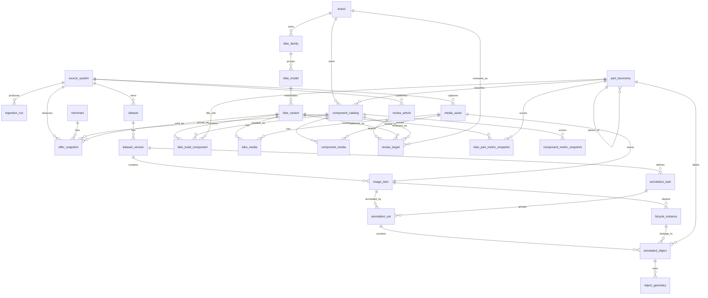

# 自行车统一数据库设计

## 1. 设计目标

当前项目已经具备以下几条主线：

- 开源图像数据集：`DelftBikes`、`BBBicycles`、`GeoBIKED`
- 官网产品采集：整车、配件、规格、三视图
- 市场数据：价格、报价、商品页
- 评测数据：评分、摘要、文章
- 前端热力图：`bike_name`、`brand`、`views`、`parts`、`offers`、`reviews`、`heatmap_metrics`

现有 `schema.sql` 更偏向“抓取结果入库”，适合快速落地，但还存在几个结构性问题：

- 图像数据集、图片实例、标注对象没有进入统一主模型
- 官网整车和官网配件是两套平行表，复用性有限
- `component_key` 主要靠文本归一，缺少标准化部件目录
- 热力图指标目前在导出阶段临时拼装，缺少可追踪的指标快照表
- 前端 API 依赖宽表和 Python 组装，不利于后续扩展

因此推荐升级为一套统一模型：

1. 采集与数据集层：管理来源、运行记录、原始资源
2. 视觉与标注层：管理图片、车体实例、部件标注、掩膜几何
3. 业务实体层：管理品牌、车型、配件标准实体、整车装配关系
4. 市场与评测层：管理报价、评测、目标映射
5. 指标与 API 层：管理热力图指标和前端消费视图

## 2. 关系图

## 3. 核心设计思路

### 3.1 一个中心事实

整个系统要围绕两个核心事实组织：

- `图片里看到了什么`
- `现实里这辆车/这个配件是什么`

前者由 `image_item -> bicycle_instance -> annotated_object -> object_geometry` 表达。
后者由 `brand -> bike_variant -> bike_build_component -> component_catalog` 表达。

这两条主线通过 `part_taxonomy` 对齐。

### 3.2 一个标准部件词表

`part_taxonomy` 是全库最关键的中枢表，建议承担四个职责：

- 统一视觉标注标签，如 `frame`、`fork`、`rear_wheel`
- 统一官网规格槽位，如 `groupset`、`brake`
- 统一热力图上色槽位，如 `wheel`、`drivetrain`
- 统一市场报价与评测挂载目标

也就是说，之后不再只依赖 `normalized_component_key` 纯文本拼接，而是让“槽位”和“具体商品”分开：

- `part_taxonomy` 表示“这个部位是什么”
- `component_catalog` 表示“这个部位装的具体商品是什么”

### 3.3 车型和图片分离

图像数据集里的一张车图，不一定能准确映射到某个官网车型；官网车型也不一定有高质量掩膜标注。
因此必须把：

- `image_item` / `bicycle_instance`
- `bike_variant`

拆开建模，避免把“视觉样本”和“商品实体”强耦合。

如果未来确实识别出图片中的车辆与某个标准车型高度相似，可以额外增加映射表，但不建议一开始就强制绑定。

### 3.4 报价与评测采用快照思维

价格和评分都不是静态值，所以不建议继续只存一份“当前值”，而应该改为：

- `offer_snapshot`
- `review_article`
- `bike_part_metric_snapshot`
- `component_metric_snapshot`

这样后续才能支持：

- 时间序列分析
- 热力图重算
- 价格波动可视化
- 不同来源可信度比较

## 4. 表分组设计

### 4.1 采集与数据集层

- `source_system`
  - 所有数据来源主表
  - 包括：官网、市场站、评测站、开源数据集、用户上传

- `ingestion_run`
  - 每次抓取、下载、转换的运行记录
  - 对应当前项目里的 `source_runs`

- `dataset`
  - 数据集主表
  - 对应 `DelftBikes`、`BBBicycles`、`GeoBIKED`

- `dataset_version`
  - 数据集版本和 split 说明
  - 支持 train/val/test 或不同标注版本

- `media_asset`
  - 所有图片、网页截图、PDF、JSON 原件统一登记
  - 后续官网三视图和标注图片都走这里

### 4.2 视觉与标注层

- `image_item`
  - 可训练、可显示的图片记录
  - 挂 dataset、split、侧视标记、质量分数

- `bicycle_instance`
  - 一张图里的一辆车
  - 支持一图多车

- `annotation_task`
  - 一批标注任务的定义
  - 记录工具、标签体系、状态

- `annotation_set`
  - 某张图的一次标注结果
  - 支持重标、复审、版本化

- `annotated_object`
  - 单个标注对象
  - 可以是 `frame`、`fork`、`rear_wheel`

- `object_geometry`
  - 具体几何
  - polygon、RLE mask、bbox、keypoints 可统一存放

### 4.3 业务实体层

- `brand`
  - 品牌字典

- `bike_family`
  - 车系，如 `TCR`、`Defy`

- `bike_model`
  - 型号或年份层

- `bike_variant`
  - 前端真正消费的“整车 SKU/版本”
  - 三视图、官网链接、MSRP 都建议落这里

- `part_taxonomy`
  - 标准部件槽位和层级词表

- `component_catalog`
  - 标准化配件目录
  - 类似 “Shimano Deore XT M8100 Rear Derailleur”

- `bike_build_component`
  - 一辆车具体装了哪些部件
  - 是官网规格表到标准部件目录的桥表

### 4.4 市场与评测层

- `merchant`
  - 商家主表

- `offer_snapshot`
  - 商品报价事实表
  - 可挂整车，也可挂配件

- `review_article`
  - 评测文章/视频/页面主表

- `review_target`
  - 评测对象桥表
  - 可挂品牌、整车、配件

### 4.5 指标与 API 层

- `bike_part_metric_snapshot`
  - 某车型在某部件槽位的热力图指标
  - 直接服务前端上色

- `component_metric_snapshot`
  - 某标准配件的价格/质量/性价比分数

- `vw_bike_core`
  - 面向前端整车基础信息视图

- `vw_bike_part_heatmap`
  - 面向前端部件热力图视图

- `vw_component_core`
  - 面向前端配件详情视图

## 5. 新模型和现有表的映射关系

| 现有表 | 新模型归属 | 处理建议 |
| --- | --- | --- |
| `dataset_manifest` | `dataset` / `dataset_version` | 拆分为“数据集定义”和“版本记录” |
| `source_runs` | `ingestion_run` | 直接升级 |
| `bikes` | `bike_variant` 或暂存表 | 先保留为外部来源暂存，再做标准化映射 |
| `components` | `component_catalog` 或暂存表 | 先标准化品牌和类目，再映射 |
| `reviews` | `review_article` | 文章主表升级 |
| `manufacturers` | `brand` | 合并成品牌字典 |
| `official_bikes` | `bike_variant` | 变成标准整车实体的主要来源 |
| `official_bike_components` | `bike_build_component` | 作为装配桥表升级 |
| `official_bike_specs` | `bike_variant_spec` 或 JSON 扩展 | 若后续规格非常重要，可单独拆表 |
| `component_market_offers` | `offer_snapshot` | 改为时间快照事实表 |
| `component_quality_reviews` | `review_target` + 指标层 | 不再只绑 `component_key` |
| `official_components` | `component_catalog` | 变成标准配件目录来源 |
| `official_component_specs` | `component_catalog_spec` 或 JSON 扩展 | 可选拆分 |
| `official_bike_rows` | API 视图/导出层 | 不建议再做实体主表 |
| `official_component_rows` | API 视图/导出层 | 不建议再做实体主表 |

## 6. 建库建议

### 6.1 必须保留的规范化主表

这几张表应该成为未来数据库的主干：

- `source_system`
- `ingestion_run`
- `dataset`
- `dataset_version`
- `media_asset`
- `image_item`
- `bicycle_instance`
- `annotation_task`
- `annotation_set`
- `annotated_object`
- `object_geometry`
- `brand`
- `part_taxonomy`
- `bike_variant`
- `component_catalog`
- `bike_build_component`
- `merchant`
- `offer_snapshot`
- `review_article`
- `review_target`
- `bike_part_metric_snapshot`
- `component_metric_snapshot`

### 6.2 宽表只做导出，不做主存储

像当前的：

- `official_bike_rows`
- `official_component_rows`

仍然有价值，但更适合作为：

- 导出表
- 物化视图
- API cache

而不是业务主表。

### 6.3 先统一“槽位”，再统一“商品”

落地顺序建议：

1. 先把官网规格中的 `Frame / Fork / Brake / Drivetrain / Wheel` 映射到 `part_taxonomy`
2. 再把具体规格值映射到 `component_catalog`
3. 再把市场报价和评测绑到 `component_catalog`
4. 最后计算 `bike_part_metric_snapshot`

这样能显著降低纯文本匹配带来的误配。

## 7. 推荐实施顺序

### Phase 1

- 保持现有 ETL 可跑
- 新增统一 schema
- 增加 `brand`、`part_taxonomy`、`component_catalog`、`bike_variant`、`bike_build_component`

### Phase 2

- 把 `official_bikes` 和 `official_components` 迁入标准实体
- 把 `component_market_offers` 和 `component_quality_reviews` 改造成快照事实表

### Phase 3

- 把 `image_item`、`annotation_set`、`annotated_object`、`object_geometry` 接入训练数据流
- 把标注数据和热力图槽位统一到 `part_taxonomy`

### Phase 4

- 用视图或导出脚本重建前端 API
- 弱化旧宽表在主流程中的地位

## 8. 结论

如果你的目标是“同时支撑数据集训练、官网产品仓库、市场价格分析、质量评测聚合、前端热力图展示”，那么最合理的数据库核心不应该是“网页抓下来是什么”，而应该是：

- 标准品牌
- 标准车型
- 标准部件槽位
- 标准配件目录
- 图片实例与标注对象
- 报价和评测快照
- 面向热力图的指标结果

这也是 `sql/unified_schema.sql` 采用的设计原则。
